**MyChat软件报告**

1.  **产品功能介绍**

    MyChat是一款为智能终端提供即时通讯服务的免费安卓应用程序。MyChat支持多种文件类型的单聊、群聊功能，在使用体验上具有轻量、便捷、高效等特点，在即时通讯上搭载了腾讯云的即时通讯IM服务，具有高并发、高可靠的通信能力。

    功能简易图文介绍(具体详见演示视频)：

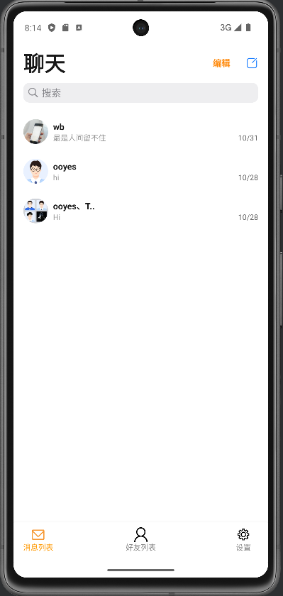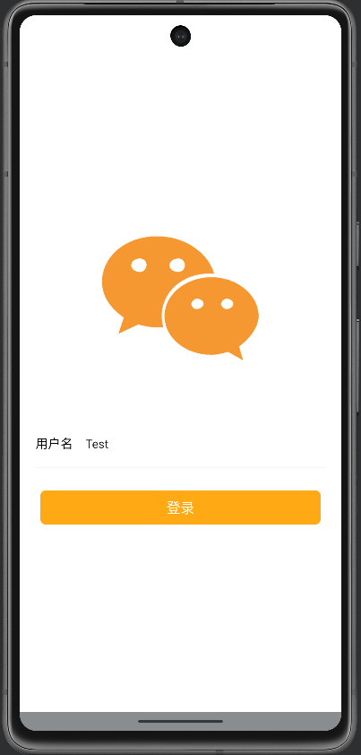

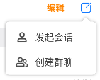

第一次进入MyChat，会进入登录界面，输入一个唯一的用户名来创建一个账户（由于目前软件使用的是腾讯云IM的基础服务，仅支持100人上限的聊天，当前MyChat的定位是通过个人在腾讯云的注册，获取体验版套餐，并在MyChat中配置用户/密钥等信息供私人群体使用，故不需要密码，安全由个人负责），创建完成后将自动登录进入主界面，默认选择消息列表一栏。

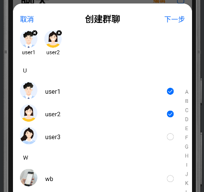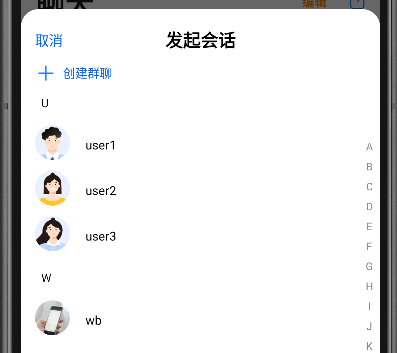

首次登入时消息列表为空，需要点击右上角的编辑按钮进行“发起会话“或”创建群聊“操作，并在好友列表中选择操作的对象,创建成功后将在消息列表显示会话或群聊。

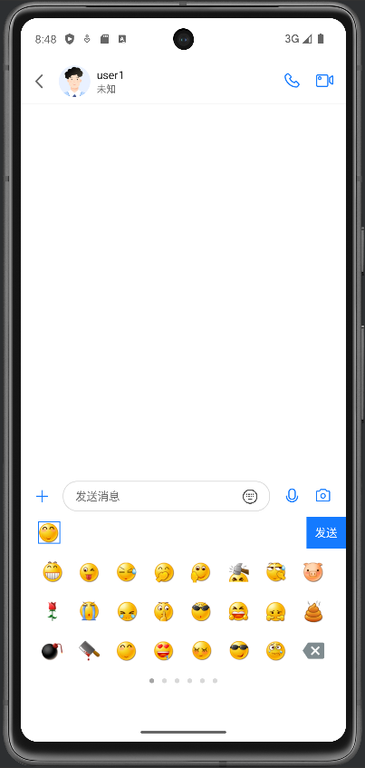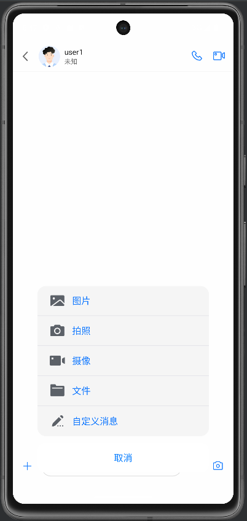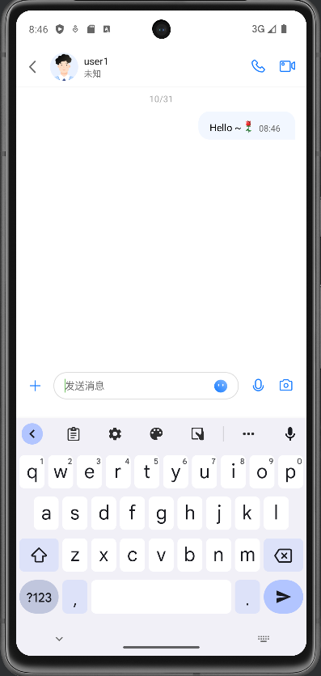创建群聊时可以编辑群名称、群类型、群头像等信息。

进入与好友user1的单聊会话界面，可以发送文本消息、语音消息、图片表情、视频或文件，以及其他自定义的消息如转发的视频链接等，视频通话、语音通话等功能需要在腾讯云开通服务后使用。

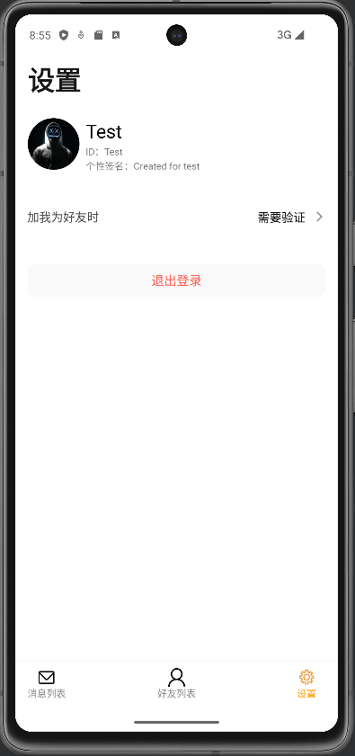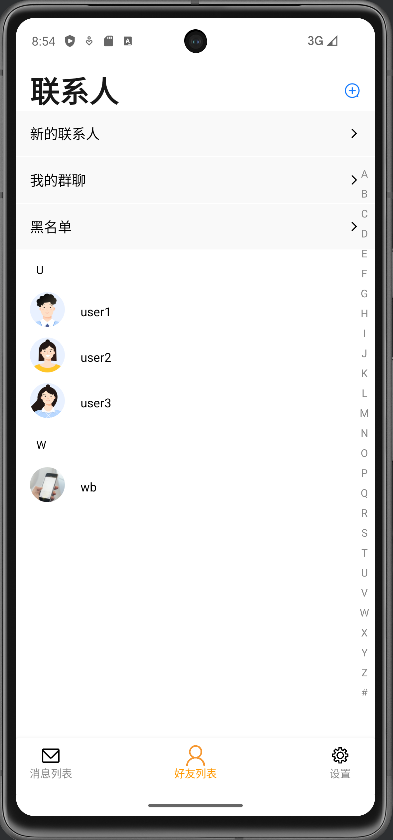

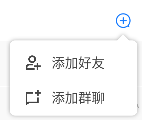

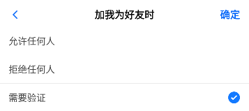

点击下方的“好友列表“按钮，进入好友列表一栏，会按照首字母排列顺序显示所有联系人，点击右上方的+按钮来添加好友或群聊，”新的联系人“一栏，会根据设置界面中——”加我为好友时“的相关选项，出现他人的添加请求。

此处省略包含的一些细小功能：黑名单、个人头像、个性签名、聊天背景、个人信息设置等。

1.  **程序概要设计**

    开发平台：Windows 11 Android Studio

    主要语言：Java

    主要组件库：TUIKIT (TUIKIT 即时通讯IM相关参考的文档为：[即时通信 IM 快速入门（Android）-快速入门-文档中心-腾讯云 (tencent.com)](https://cloud.tencent.com/document/product/269/36838))

程序采用C/S结构，此处Server为腾讯云服务器，故主要工作为客户端开发。客户端设计包含‘前端界面-UI设计‘和‘代码-交互实现’两部分。（MyChat程序是在参考了腾讯云 即时通信IM的demo的基础上设计的，部分UI、动画实现，主要的代码逻辑仿照demo设计）

由于TUIKIT中集成了TUICHAT、TUIContact、TUIConversation、TUIGroup、TUISearch等UI组件，故UI设计仅需一个登陆界面及其他一些基础界面的框架即可，此处使用Android Studio快速设计UI。

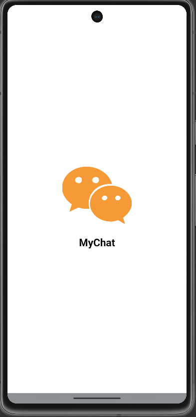

图8为一个简单的程序进入的flash。

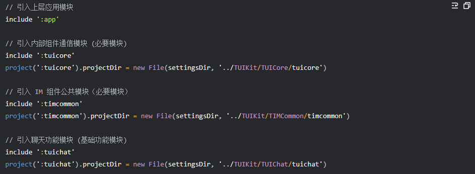

代码方面借助样例demo的逻辑设计，在TUIKIT便捷、高效的模块帮助下，非常轻松地就能实现各种功能。

1.  **软件架构图**

    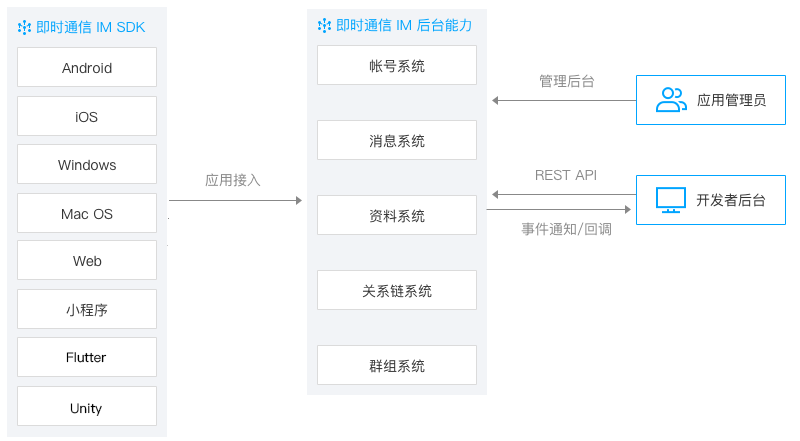即时通讯IM的架构如图：

    安卓软件的架构如图：

    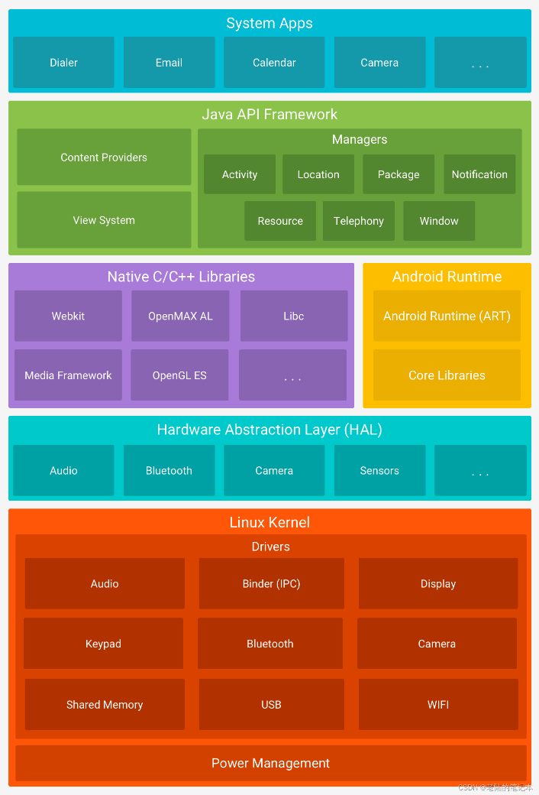

    显然，在TUIKIT和服务的帮助下，我们仅需要设计出一个简单的MVC架构即可。

2.  **技术亮点及其实现原理**

**群组离线消息的处理：**

场景：用户A离线的情况下， 用户B在一个两者共有的群组G中发送了一条消息。如何让用户A在下次登陆时接受到该消息。

处理方法：使用IM后台的历史消息存储服务器。在B发送后将群组G添加为A的最近联系人，并把消息存入服务器，设定一个时间限制（过期无效）。当用户A登录时，向服务器拉取群组、最近联系人的最新消息，完成同步。

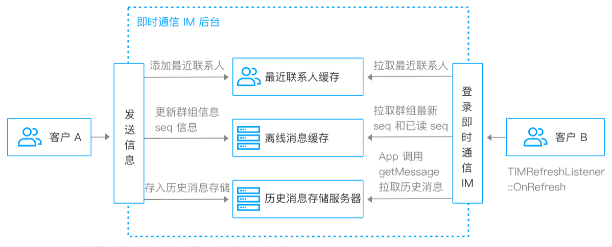

图表来源：IM文档

1.  **可拓展的功能（未来展望）**

    社群服务：为不同圈子的小团体设置的聊天论坛服务，方便资源分享利用。

    音视频通话实现：通过升级云套餐，完善程序功能，为用户提供音视频通话服务。

    离线推送：通过智能手机各自携带的系统级推送通道来进行消息通知，相比后台挂起，将大幅降低资源消耗，实现随时接受推送的消息。
